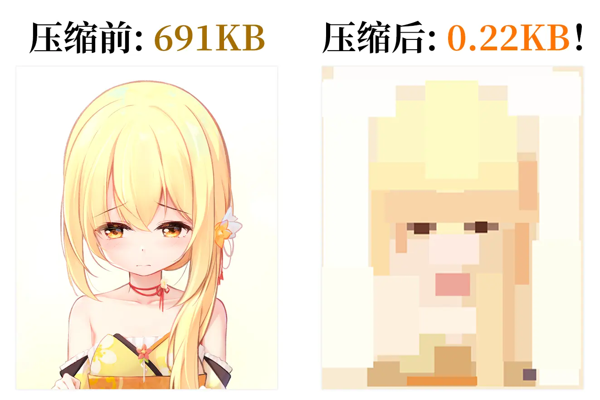
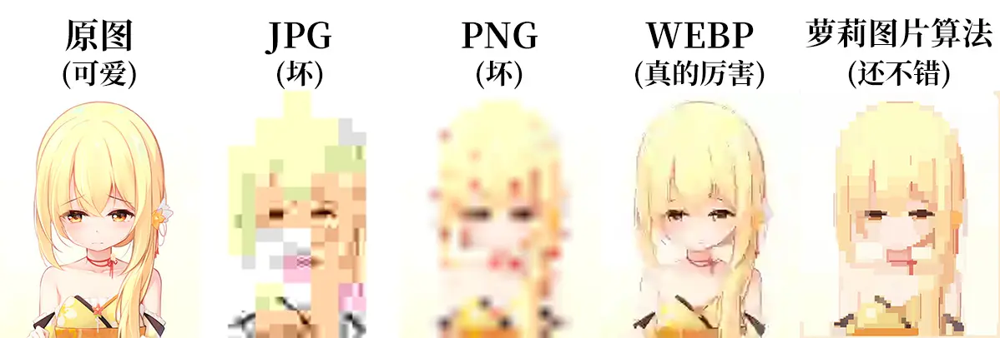

# 【萝莉图片算法】高损图像压缩算法！？

我又发明出新算法了！

这次我发明的是新型高损图像压缩算法——萝莉图片算法！为什么是萝莉图片，这是因为它是使动用法，让图片变小所以是萝莉图片，大家一定要学好语文哦！


## 压缩效果

太神奇了！压缩率竟然高达99.97%！



## 与常见压缩算法对比

在图片最终大小为1KB的情况下，我们将萝莉图片与JPG、PNG、WEBP比较——



看起来萝莉图片算法的质量还不错！

不过其他算法设成最低质量也压不到1KB，所以原图是提前压过分辨率的。


## 原理

原理非常简单——如果莉沫酱在白纸上画长方形，只要她画得足够多，就可以画出任何的图像细节。而如果能画得准确，她就可以用少量的数据来表示出画像的主体部分。

这里用了一个简单的贪心算法来计算每一个长方形的画法，我们设置一个代价函数作为贪的目标，是让原图和目标图的每个像素的误差的平方和(SE)最小。

我们每次暴搜一个长方形的左上角和右下角，假设将原图中长方形内部的所有像素取均值作为压缩图的长方形填充颜色，以此来减小SE。然后把那个最能削减SE的长方形真正地填上。

嗯，就是这么简单。

对了，顺便一说我写完以后发现这个代价函数好像是可以优化到O(1)的但是我太累了动不了了……下次再写吧。


## 安装和使用方法

首先你需要一个Python3.6以上版本。

然后——
```sh
pip install git+https://github.com/RimoChan/loliimg.git
```

装好之后在要用的时候import就行啦！

```python
import cv2
import loliimg

img = cv2.imread('ori.png')
res = loliimg.ride(img, 3, verbose=False)
for pos, color in res:
    print(pos, color)
```

打出来之后你就可以拿着`pos`和`color`去干一些别的事情，比如生成SVG之类的。

接口只有1个，是`loliimg.ride`，长这样——

```python
def ride(真原图, epoch, 中间结果存储位置=None, verbose=True): 
    ...
```

参数第一个是输入的图片，3维度的np.array，第二个是要跑多少轮，第三个是中间结果存储位置，一个Path字符串，第四个是要不要显示每个epoch的进度条。